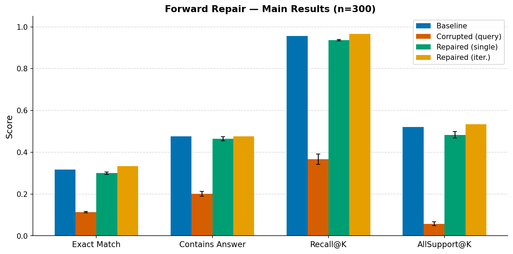
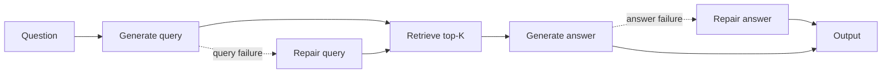

<div align="center">

# Forward Repair for RAG Pipelines

**When one stage fails, repair that stage—not the entire pipeline.**

[](https://github.com/santinomarial/forward-repair-lm-pipelines/actions/workflows/ci.yml)
[](LICENSE)

</div>

This project studies failure recovery in a multi-stage RAG system. It injects a controlled failure into query or answer generation, repairs only the damaged stage, and measures how well that repair propagates downstream.

The result is a reproducible [DSPy](https://github.com/stanfordnlp/dspy) evaluation pipeline with swappable retrieval and LLM backends, gold-free failure routing, paired statistical tests, and per-stage cost and latency telemetry.

Try the [saved-case explorer](#interactive-demo)—no API key or model download required.

- Architected a **Python/DSPy** framework that injects, isolates, and repairs query- or answer-stage RAG failures without rerunning unaffected stages.
- Demonstrated across **300 HotpotQA examples** that query repair improved exact match by **19.3 percentage points**, while answer repair recovered only **2.2%** of failures.
- Engineered interchangeable **BM25/dense retrieval** and **OpenAI/Ollama** backends with cost and latency telemetry, **155 deterministic tests**, **96%+ targeted coverage**, and automated CI.

## Why this matters

RAG failures are rarely uniform. A poor query, weak retrieval, and an ungrounded answer require different interventions. Retrying the full pipeline hides that distinction and spends more compute without identifying the source of failure.

This repository makes the failure boundary explicit:

- Query repair regenerates the query, retrieves again, and answers from new evidence.
- Answer repair keeps retrieval fixed and revises only the answer.
- Iterative repair decomposes a failed query into two searches and merges their ranked results.

The main finding in these controlled runs: **query repair recovers substantially more failures than the tested answer-revision prompt.**

## Main results

HotpotQA distractor split · BM25 · `gpt-4o-mini`

Query repair: 300 examples × 3 seeds. Iterative and answer-stage analyses: 300 examples, seed 0.

| Condition | Exact match | Recall@K | All support@K | Recovery rate |
|:--|--:|--:|--:|--:|
| Baseline | 31.7% | 95.7% | 52.0% | — |
| Corrupted query | 11.3% ± 0.3 | 36.7% ± 2.5 | 5.8% ± 1.0 | — |
| Single-shot query repair | 30.0% ± 0.6 | 93.7% ± 0.3 | 48.3% ± 1.5 | 24.6% ± 0.4 |
| Iterative query repair | **33.3%** | **96.7%** | **53.3%** | **27.3%** |
| Corrupted answer | 7.7% | 95.7% | 52.0% | — |
| Answer repair | 7.0% | 95.7% | 52.0% | 2.2% |

Query repair restores most of the baseline retrieval and exact-match performance. In the multi-hop stratum, EM rises from 49.4% with single-shot repair to 61.0% with iterative repair. Answer-stage repair barely recovers failures despite receiving the same evidence. Anchoring to the previous answer is one possible explanation; the original experiment does not isolate that mechanism.



### Statistical check

Paired bootstrap · seed 0 · 20,000 resamples · 95% percentile intervals

| Comparison | Paired difference | 95% CI |
|:--|--:|:--|
| Corrupted → repaired query EM | **+19.3 pp** | [14.3, 24.7] |
| Single-shot → iterative recovery | +2.6 pp | [−1.5, 7.1] |

The query-repair gain is clearly positive. The aggregate iterative lift is promising but not conclusive; its strongest gains are concentrated in multi-hop and yes/no strata.

### Answer repair versus fresh generation

Follow-up run · 300 questions · `gpt-4o-mini` · fixed saved evidence · seed 0

Revision sees the previous answer. Blind revision removes only that input field, keeping the repair instructions. Fresh generation uses the baseline answer prompt without the previous answer.

| Condition | Exact match | Contains answer | Recovery | Damage |
|:--|--:|--:|--:|--:|
| Revision | 8.3% | 48.0% | 3.6% | 34.8% |
| Blind revision | 19.3% | 49.0% | 14.8% | 26.1% |
| Fresh generation | **31.7%** | 47.3% | **26.7%** | **8.7%** |

Recovery uses the 277 initially wrong answers; damage uses the 23 initially correct answers. All three conditions were generated in this new run, with the same model settings, randomized execution order, and DSPy caching disabled.

Removing the previous-answer field improved EM by **11.0 pp [7.3, 15.0]**. Fresh generation improved EM over revision by **23.3 pp [18.3, 28.3]**, but also changed the instructions. Intervals use 20,000 paired bootstrap resamples; the first contrast is primary and the second exploratory.

**Interpretation:** this is an exact-match gain, not an equivalent factuality gain. In 30 of the 36 cases where blind revision gained an exact match, the visible-answer revision already contained the gold answer. Response format is an important part of the effect. The result qualifies the earlier anchoring hypothesis rather than establishing a general failure of answer repair.

The full comparison used **900 calls**, at an estimated **$0.127** for answer generation. Fresh generation cost about 12% less per example than revision in this run. Raw answers, confidence intervals, and telemetry are saved in the [results](outputs/answer_ablation_seed0_results.jsonl) and [summary](outputs/answer_ablation_seed0_summary.json).

```bash
# Small live check: three answer generations per example.
python src/answer_ablation.py --max-examples 10 --output-suffix answer_ablation_smoke

# Full evaluation, using the existing 300-example answer-corruption file.
python src/answer_ablation.py --max-examples 300
```

Use a new `--output-suffix` for another run, or `--resume` to reuse completed records. See the [protocol and detailed results](docs/answer_ablation.md) for offline analysis and limitations. The historical results above are unchanged.

### Outcome routing and generalization

A cost-sensitive controller learns from observed action outcomes on 180 training questions; 60 validation questions select its settings. The model is frozen before evaluating 60 held-out questions across five states each. Two corruption mechanisms—query-term substitution and retrieval-rank dropout—appear only at test time.

| Policy | Seen failures · EM | Unseen corruptions · EM | Natural outputs · EM |
|:--|--:|--:|--:|
| No repair | 7.5% | 22.5% | 35.0% |
| Always rewrite query | 35.0% | 35.0% | 35.0% |
| Retrieve more documents | 25.0% | 36.7% | 36.7% |
| Fresh answer, same evidence | 24.2% | 22.5% | 36.7% |
| Outcome-trained router | **36.7%** | **37.5%** | 35.0% |

Against no repair, the router gains **29.2 pp [18.3, 40.0]** on seen failures and **15.0 pp [8.3, 22.5]** on unseen corruptions. Its small advantages over always rewriting are **not conclusive**. Natural outputs show **no net EM gain: 0.0 pp [−5.0, 5.0]**. These are 95% pointwise intervals from 10,000 paired question-clustered bootstrap resamples, without multiplicity adjustment.

Recovery is 37/111 (33.3%) on seen failures, 19/93 (20.4%) on unseen corruptions, and 1/39 (2.6%) on natural errors. The router also damages 2/9, 1/27, and 1/21 initially correct answers, respectively. Small harm denominators matter; the [full report](outputs/reliability_study/report.md) includes their wide confidence intervals.

Selected router actions, incremental per case:

| Test group | Calls | Tokens | Estimated cost | Mean wall time |
|:--|--:|--:|--:|--:|
| Seen failures | 1.32 | 1,229 | $0.000196 | 1.03s |
| Unseen corruptions | 1.47 | 937 | $0.000152 | 1.39s |
| Natural outputs | 1.12 | 878 | $0.000131 | 1.16s |

Fewer calls do not always mean lower cost: on seen failures, context expansion makes the router slightly more expensive than always rewriting ($0.000190/case). Wall times include API pacing and exclude the original forward pass; they are not serving benchmarks.

**Takeaway:** the policy transfers to these two new perturbations, but that does not establish an improvement on naturally occurring errors or superiority over strong fixed strategies. This is one model seed within HotpotQA, evaluated offline from observed action outcomes—not a production trial.

The complete study collected **780 states and 3,240 successful calls**, costing an estimated **$0.455** for completed cases. Conservative reservations, including interrupted requests, totaled **$1.43** under a $3 cap. See the [protocol](docs/reliability_study.md) and [machine-readable results](outputs/reliability_study/summary.json).

An [offline error audit](outputs/error_audit/report.md) flags 21 of 57 EM recoveries where the initial response already contained the gold phrase, plus 15 cases where another saved action succeeded. These are review signals, not semantic verdicts. A deterministic [20-case review queue](outputs/error_audit/review_queue.jsonl) includes all four harmful repairs; human review is still pending. See the [review rubric](docs/error_audit.md).

### Cost of repair

The final [natural-error study](docs/natural_study.md) is in progress: 600 fresh
questions, a locked 300-question holdout, evidence-preserving repair, and
natural-outcome/damage-aware controllers under one **$5 reservation cap**.
This follow-up uses a new pooled corpus; its EM is not directly comparable to the
historical table. No positive result is assumed in advance.

Cold-cache snapshot · 10 examples · `gpt-4o-mini`

| Condition | Calls / example | Tokens / example | Cost / example | Latency / example |
|:--|--:|--:|--:|--:|
| Baseline | 2.0 | 983 | $0.000164 | 2.01s |
| Corrupted query | 2.0 | 1,120 | $0.000183 | 1.79s |
| Single-shot repair | 2.0 | 1,123 | $0.000188 | 1.78s |
| Iterative repair | 2.0 | 1,282 | $0.000250 | 2.64s |

Iterative repair generates both sub-queries in one LLM call, but performs retrieval twice. In this run it used 14% more tokens, cost 33% more, and took 48% longer than single-shot repair. Every run records raw per-example telemetry and per-condition aggregates; latency will vary by environment.

## How it works



`ForwardRepairPipeline` owns orchestration; the retriever and LLM are injected behind stable interfaces. The corruption and repair logic therefore stays unchanged across backends.

| Component | Implementations |
|:--|:--|
| Retrieval | BM25; sentence-transformer cosine similarity |
| LLM | OpenAI; local Ollama models through DSPy/LiteLLM |
| Routing | Gold-free diagnostics; heuristic, stage-attribution, and outcome-trained policies |
| Evaluation | Exact match, token F1, contains-answer, retrieval metrics, recovery and damage |
| Analysis | Multi-hop strata, seed aggregation, paired bootstrap confidence intervals |

### Adaptive routing

`--include-adaptive` evaluates the corrupted output exactly as a deployed system would see it: without the gold answer or support labels. The detector measures retrieval-score separation, question/query coverage in the retrieved documents, and answer grounding. The policy then accepts the output or dispatches query, answer, or iterative repair.

```bash
python src/experiment.py \
  --include-adaptive \
  --max-examples 10
```

The heuristic policy is an interpretable four-action baseline. A learned three-way stage router can be trained offline from the existing controlled runs:

```bash
python src/train_router.py
python src/experiment.py \
  --include-adaptive \
  --adaptive-policy learned \
  --router-model outputs/adaptive_router_model.json \
  --max-examples 10
```

Training is grouped by question ID, so baseline, query-corrupted, and answer-corrupted variants of a question never cross the train/test boundary. Across five 80/20 grouped holdouts, the router reaches **79.3% ± 2.0% accuracy** and **0.788 ± 0.020 macro-F1** on stage attribution. On this balanced attribution benchmark, it predicts repair for **70.7% ± 4.0%** of cases, avoiding about 29% of unconditional repairs.

These are attribution results, not end-to-end recovery claims. Iterative escalation remains heuristic because the current data contains only 24 iterative-only successes—too few for a defensible learned fourth class. The outcome-based study above evaluates a separate policy using observed repair success and cost.

### Outcome-based routing study

The frozen outcome router predicts `EM − 100 × incremental USD cost` from
gold-free initial-state features. Its [model artifact](outputs/reliability_study/model.json)
records validation selection and input hashes. Rebuild the published report
without API calls:

```bash
python src/reliability_study.py report
```

For a new paid run, follow the [replication commands](docs/reliability_study.md#commands).
Collection is resumable, rate-limited, and capped at $3 in request reservations.

## Quick start

Python 3.11 is recommended.

```bash
python3 -m venv .venv
source .venv/bin/activate
pip install -r requirements-dev.txt -c constraints-research.txt
```

Verify the checkout with one command:

The constraints preserve the published research runtime's direct dependency versions.
Provider outputs and wall-clock latency can still change.

```bash
make check
```

### OpenAI

Create a `.env` file in the repository root:

```env
OPENAI_API_KEY=sk-...
OPENAI_MODEL=gpt-4o-mini
```

Run a small experiment:

```bash
python src/experiment.py --max-examples 10
```

### Local inference with Ollama

Install [Ollama](https://ollama.com/), then pull and run a local model—no API key required:

```bash
ollama pull llama3.2:3b
python src/experiment.py \
  --llm ollama \
  --model llama3.2:3b \
  --max-examples 10
```

The default endpoint is `http://localhost:11434`. Override it with `--ollama-api-base` or `OLLAMA_API_BASE`.

### Interactive demo

```bash
pip install -r requirements-demo.txt
streamlit run demo/app.py
```

The default **Saved experiments** mode replays all 300 held-out states without an API key:

- Filter recoveries, harmful repairs, correct answers kept unchanged, or missed recovery opportunities.
- Inspect the frozen router's decision, before/after evidence, and all four saved action outcomes.
- Compare recorded calls, tokens, cost, and latency; export a complete case with source hashes.
- Review the 20-case audit queue and download your annotations. Reviews stay in the browser session until downloaded; published results are never changed.

Start with **Recovered → Harmed → Kept correct**. Case links preserve the selected ID in `?case=…`.
“Correct” here means exact match; the interface distinguishes lexical scores from semantic judgments.

The separate **Live playground** retains the original corruption/repair demo using the experiment pipeline. It requires a configured backend and can incur API charges; the study collection cap does not apply. Nothing runs until you click a generation button.

Regenerate the audit without paid calls:

```bash
python src/error_audit.py
```

## Reproduce the study

Build the 300-example HotpotQA subset:

```bash
python src/build_hotpot_subset.py --n 300
```

Run query corruption, iterative repair, and answer corruption:

```bash
python src/experiment.py --seed 0 --output-suffix hotpot_300_seed0
python src/experiment.py --seed 0 --output-suffix hotpot_300_iterative_seed0 --include-iterative
python src/experiment.py --seed 0 --output-suffix hotpot_300_answer_seed0 --corrupt-stage answer
```

Then analyze the saved outputs without making new LLM calls:

```bash
python src/aggregate_seeds.py
python src/stratified_analysis.py \
  --input outputs/hotpot_300_iterative_seed0_results_renormalized.jsonl
python src/significance.py
python src/make_final_figures.py
```

Useful switches:

| Goal | Option |
|:--|:--|
| Dense retrieval | Install `requirements-dense.txt`, then pass `--retriever dense` |
| Different encoder | `--dense-model sentence-transformers/all-MiniLM-L6-v2` |
| Cold latency measurement | `--disable-lm-cache` |
| Gold-free repair routing | `--include-adaptive` |
| Learned stage router | Add `--adaptive-policy learned` after running `src/train_router.py` |
| Fast smoke run | `--max-examples 10` |
| Re-score saved generations | `python src/rescore.py --input <results.jsonl>` |

Results are written to `outputs/<suffix>_results.jsonl`; aggregate summaries go to `outputs/<suffix>_summary.json`.

## Engineering quality

The test suite uses deterministic fixtures and mocks—never live LLM calls.

```bash
make check  # lint, type checks, tests, and a 90% targeted coverage gate
```

CI runs the same checks on every push and pull request. Tests cover metrics, retrieval, backend contracts, telemetry, paired statistics, leakage guards, resumable collection, and offline evidence reconstruction. Headless Streamlit tests cover filters, deep links, saved alternatives, review exports, and live-mode isolation, with provider calls forbidden. Targeted coverage includes both routing studies, answer ablation, the spending guard, and audit/replay utilities.

## Limitations

- Injected failures and unmodified benchmark errors do not represent production traffic.
- The learned router is evaluated within the HotpotQA benchmark family; cross-dataset generalization remains untested.
- Iterative and answer-stage results use one seed, and model outputs remain provider- and version-dependent.
- The iterative recovery-rate lift is not statistically conclusive at the aggregate level.

## Project map

```text
src/
├── pipeline.py             # forward pass, corruption, and localized repair
├── experiment.py           # experiment CLI and condition runner
├── retriever.py            # Retriever interface, BM25, and dense search
├── llm_backends.py         # OpenAI and Ollama backend factory
├── dspy_modules.py         # typed DSPy signatures and modules
├── metrics.py              # answer and retrieval metrics
├── routing.py              # gold-free failure signals and repair policies
├── train_router.py         # grouped training and held-out router evaluation
├── telemetry.py            # calls, tokens, cost, and stage latency
├── significance.py         # paired bootstrap comparisons
├── answer_ablation.py      # fixed-evidence revision versus regeneration study
├── outcome_routing.py      # cost-sensitive policy learned from action outcomes
├── reliability_study.py    # budgeted collection, model freeze, held-out evaluation
├── reliability_analysis.py # paired, question-clustered recovery and harm report
├── natural_study.py        # fresh natural errors, shared-query controls, $5 cap
├── natural_routing.py      # natural-outcome and damage-penalized controllers
├── natural_analysis.py     # frozen holdout, paired intervals, review queue
├── experiment_budget.py    # persistent spending guard and request pacing
├── case_explorer.py        # verified, read-only replay and case filtering
├── error_audit.py          # automatic signals and pending review queue
├── stratified_analysis.py  # single-hop and multi-hop analysis
└── make_final_figures.py   # publication-ready figures and tables

demo/app.py                 # offline-first Streamlit explorer + live playground
tests/                      # deterministic unit and integration tests
outputs/                    # saved runs, summaries, figures, and tables
```

The implementation favors explicit interfaces, saved intermediate results, and analysis that can be repeated without paying for another model run. That keeps backend changes isolated and experimental claims auditable.

## License

Released under the [MIT License](LICENSE).
