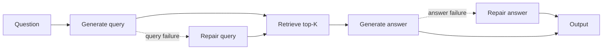

<div align="center">

# Forward Repair for RAG Pipelines

**When one stage fails, repair that stage—not the entire pipeline.**

[](https://github.com/santinomarial/forward-repair-lm-pipelines/actions/workflows/ci.yml)

</div>

This project studies failure recovery in a multi-stage RAG system. It injects a controlled failure into query or answer generation, repairs only the damaged stage, and measures how well that repair propagates downstream.

The result is a reproducible [DSPy](https://github.com/stanfordnlp/dspy) evaluation pipeline with swappable retrieval and LLM backends, gold-free failure routing, paired statistical tests, and per-stage cost and latency telemetry.

## Why this matters

RAG failures are rarely uniform. A poor query, weak retrieval, and an ungrounded answer require different interventions. Retrying the full pipeline hides that distinction and spends more compute without identifying the source of failure.

This repository makes the failure boundary explicit:

- Query repair regenerates the query, retrieves again, and answers from new evidence.
- Answer repair keeps retrieval fixed and revises only the answer.
- Iterative repair decomposes a failed query into two searches and merges their ranked results.

The main finding: **repairing retrieval upstream is effective; repairing an already-confident answer is not.**

## Main results

HotpotQA distractor split · 300 examples · three seeds · BM25 · `gpt-4o-mini`

| Condition | Exact match | Recall@K | All support@K | Recovery rate |
|:--|--:|--:|--:|--:|
| Baseline | 31.7% | 95.7% | 52.0% | — |
| Corrupted query | 11.3% ± 0.3 | 36.7% ± 2.5 | 5.8% ± 1.0 | — |
| Single-shot query repair | 30.0% ± 0.6 | 93.7% ± 0.3 | 48.3% ± 1.5 | 24.6% ± 0.4 |
| Iterative query repair | **33.3%** | **96.7%** | **53.3%** | **27.3%** |
| Corrupted answer | 7.7% | 95.7% | 52.0% | — |
| Answer repair | 7.0% | 95.7% | 52.0% | 2.2% |

Query repair restores most of the baseline retrieval and exact-match performance. Iterative repair is especially useful on genuinely multi-hop questions: EM rises from 49.4% with single-shot repair to 61.0%. Answer-stage repair barely recovers failures despite receiving the same evidence, suggesting that revision remains anchored to the original wrong answer.

### Statistical check

Paired bootstrap · seed 0 · 20,000 resamples · 95% percentile intervals

| Comparison | Paired difference | 95% CI |
|:--|--:|:--|
| Corrupted → repaired query EM | **+19.3 pp** | [14.3, 24.7] |
| Single-shot → iterative recovery | +2.6 pp | [−1.5, 7.1] |

The query-repair gain is clearly positive. The aggregate iterative lift is promising but not conclusive; its strongest gains are concentrated in multi-hop and yes/no strata.

### Cost of repair

Cold-cache snapshot · 10 examples · `gpt-4o-mini`

| Condition | Calls / example | Tokens / example | Cost / example | Latency / example |
|:--|--:|--:|--:|--:|
| Baseline | 2.0 | 983 | $0.000164 | 2.01s |
| Corrupted query | 2.0 | 1,120 | $0.000183 | 1.79s |
| Single-shot repair | 2.0 | 1,123 | $0.000188 | 1.78s |
| Iterative repair | 2.0 | 1,282 | $0.000250 | 2.64s |

Iterative repair generates both sub-queries in one LLM call, but performs retrieval twice. In this run it used 14% more tokens, cost 33% more, and took 48% longer than single-shot repair. Every run records raw per-example telemetry and per-condition aggregates; latency will vary by environment.

## How it works



`ForwardRepairPipeline` owns orchestration; the retriever and LLM are injected behind stable interfaces. The corruption and repair logic therefore stays unchanged across backends.

| Component | Implementations |
|:--|:--|
| Retrieval | BM25; sentence-transformer cosine similarity |
| LLM | OpenAI; local Ollama models through DSPy/LiteLLM |
| Routing | Gold-free lexical diagnostics; transparent heuristic repair policy |
| Evaluation | Exact match, contains-answer, Recall@K, AllSupport@K, recovery rate |
| Analysis | Multi-hop strata, seed aggregation, paired bootstrap confidence intervals |

### Adaptive routing

`--include-adaptive` evaluates the corrupted output exactly as a deployed system would see it: without the gold answer or support labels. The detector measures retrieval-score separation, question/query coverage in the retrieved documents, and answer grounding. The policy then accepts the output or dispatches query, answer, or iterative repair.

```bash
python src/experiment.py \
  --include-adaptive \
  --max-examples 10
```

The current heuristic is an interpretable baseline for the learned router—not a claim that lexical signals solve failure attribution. In particular, it handles yes/no answers conservatively because lexical overlap cannot establish entailment.

## Quick start

Python 3.11 is recommended.

```bash
python3 -m venv .venv
source .venv/bin/activate
pip install -r requirements.txt
pip install -r requirements-dev.txt
```

### OpenAI

Create a `.env` file in the repository root:

```env
OPENAI_API_KEY=sk-...
OPENAI_MODEL=gpt-4o-mini
```

Run a small experiment:

```bash
python src/experiment.py --max-examples 10
```

### Local inference with Ollama

Install [Ollama](https://ollama.com/), then pull and run a local model—no API key required:

```bash
ollama pull llama3.2:3b
python src/experiment.py \
  --llm ollama \
  --model llama3.2:3b \
  --max-examples 10
```

The default endpoint is `http://localhost:11434`. Override it with `--ollama-api-base` or `OLLAMA_API_BASE`.

### Interactive demo

```bash
pip install -r requirements-demo.txt
streamlit run demo/app.py
```

The demo exposes the generated query, ranked documents, and answer, then shows corruption and repair side by side. It uses the same pipeline code as the experiment runner.

## Reproduce the study

Build the 300-example HotpotQA subset:

```bash
python src/build_hotpot_subset.py --n 300
```

Run query corruption, iterative repair, and answer corruption:

```bash
python src/experiment.py --seed 0 --output-suffix hotpot_300_seed0
python src/experiment.py --seed 0 --output-suffix hotpot_300_iterative_seed0 --include-iterative
python src/experiment.py --seed 0 --output-suffix hotpot_300_answer_seed0 --corrupt-stage answer
```

Then analyze the saved outputs without making new LLM calls:

```bash
python src/aggregate_seeds.py
python src/stratified_analysis.py \
  --input outputs/hotpot_300_iterative_seed0_results_renormalized.jsonl
python src/significance.py
python src/make_final_figures.py
```

Useful switches:

| Goal | Option |
|:--|:--|
| Dense retrieval | Install `requirements-dense.txt`, then pass `--retriever dense` |
| Different encoder | `--dense-model sentence-transformers/all-MiniLM-L6-v2` |
| Cold latency measurement | `--disable-lm-cache` |
| Gold-free repair routing | `--include-adaptive` |
| Fast smoke run | `--max-examples 10` |
| Re-score saved generations | `python src/rescore.py --input <results.jsonl>` |

Results are written to `outputs/<suffix>_results.jsonl`; aggregate summaries go to `outputs/<suffix>_summary.json`.

## Engineering quality

The test suite uses deterministic fixtures and mocks—never live LLM calls.

```bash
pytest --cov=metrics --cov=retriever --cov=routing --cov-report=term-missing --cov-fail-under=90
ruff check src tests demo
mypy src/metrics.py src/retriever.py src/routing.py
```

CI runs the same checks on every push and pull request. The suite covers metric normalization and recovery math, BM25 ranking and union semantics, backend contracts, telemetry, significance testing, and stratification.

## Project map

```text
src/
├── pipeline.py             # forward pass, corruption, and localized repair
├── experiment.py           # experiment CLI and condition runner
├── retriever.py            # Retriever interface, BM25, and dense search
├── llm_backends.py         # OpenAI and Ollama backend factory
├── dspy_modules.py         # typed DSPy signatures and modules
├── metrics.py              # answer and retrieval metrics
├── routing.py              # gold-free failure signals and repair policies
├── telemetry.py            # calls, tokens, cost, and stage latency
├── significance.py         # paired bootstrap comparisons
├── stratified_analysis.py  # single-hop and multi-hop analysis
└── make_final_figures.py   # publication-ready figures and tables

demo/app.py                 # Streamlit walkthrough
tests/                      # deterministic unit and integration tests
outputs/                    # saved runs, summaries, figures, and tables
```

The implementation favors explicit interfaces, saved intermediate results, and analysis that can be repeated without paying for another model run. That keeps backend changes isolated and experimental claims auditable.
