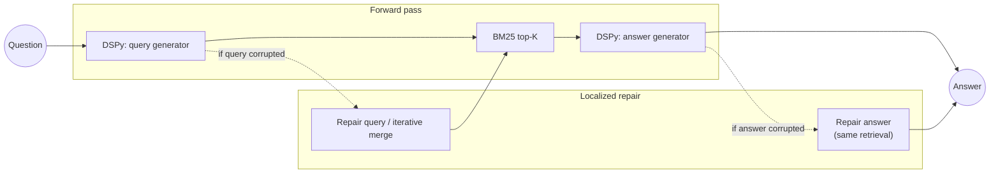

<p align="center">
  <strong>Localized Forward Repair</strong><br/>
  <em>Multi-stage LM pipelines · staged failure injection · HotpotQA</em><br/>
  <a href="https://github.com/santinomarial/forward-repair-lm-pipelines/actions/workflows/ci.yml"></a>
</p>

<hr/>

This repository implements experiments on **localized forward repair**: we corrupt exactly one stage of a question-answering pipeline (either query generation or answer generation), repair **only that stage**, and measure whether the fix propagates to retrieval quality and final exact-match scores. The pipeline is wired with [DSPy](https://github.com/stanfordnlp/dspy) signatures and evaluated on HotpotQA-style multi-hop QA with BM25 retrieval.

---

### Contents

- [Pipeline](#pipeline) — flow and localized repair hooks  
- [Experimental conditions](#experimental-conditions)  
- [Dataset](#dataset)  
- [Main results \& findings](#main-results)  
- [Repository layout](#repository-layout)  
- [Setup](#setup)  
- [Running experiments](#running-experiments)  
- [Metrics](#metrics)

---

## Pipeline

The default **forward** path mirrors a simple RAG stack: synthesize a search query → retrieve passages → produce an answer. **Repair** rewinds to the corrupted stage and re-runs only from there onward (plus optional iterative retrieval for query repair).



| Stage | Technology |
|:------|:-----------|
| Query / answer modules | DSPy `Predict` over typed signatures (`src/dspy_modules.py`) |
| Retrieval | Pluggable BM25 or sentence-transformer cosine retrieval; `retrieve_union` merges ranked lists from two sub-queries |
| Orchestration | `ForwardRepairPipeline` in [`src/pipeline.py`](src/pipeline.py) |
| Runs | [`src/experiment.py`](src/experiment.py): seeds, `--corrupt-stage`, optional `--include-iterative` |

---

## Experimental conditions

| Condition | What happens |
|:----------|:-------------|
| **Baseline** | Deterministic query generation (`temperature = 0`) → retrieve → answer |
| **Corrupted (query)** | Vague query (`temperature = 0.7`, seeded) hurts retrieval downstream |
| **Repaired single-shot** | One corrected query from the bad query → re-retrieve → re-answer |
| **Repaired iterative** | Two targeted sub-queries merged with `retrieve_union` (query corruption only) |
| **Corrupted (answer)** | Good retrieval; answer ignores context (forces ungrounded answers) |
| **Repaired (answer)** | Same documents; LM asked to revise answer using evidence |

---

## Dataset

| | |
|:---|:---|
| **Source** | HotpotQA *distractor* split via Hugging Face ([`datasets`](https://pypi.org/project/datasets/)) |
| **Build script** | [`src/build_hotpot_subset.py`](src/build_hotpot_subset.py) `--n …` writes `data/hotpot_examples.jsonl` and `data/hotpot_corpus.jsonl` |
| **Scale in paper-style runs** | 300 validation examples; BM25 corpus on the order of ~3k documents for that subset |

Examples are stratified **post hoc** ([`src/stratified_analysis.py`](src/stratified_analysis.py)):

- **Single-hop-sufficient** — gold answer traceable from one support doc  
- **Genuinely multi-hop** — comparison / yes-no or evidence needs both docs  
- **Answer-not-in-support** — excluded from stratified slices where noted  

---

## Main results

*Sample size n = 300; three seeds; table shows mean ± std where aggregated.*

| Condition | Exact Match | Contains Answer | Recall@K | AllSupport@K | Recovery Rate |
|:---:|:---:|:---:|:---:|:---:|:---:|
| Baseline | 0.317 | 0.477 | 0.957 | 0.520 | — |
| Corrupted (query) | 0.113 ± 0.003 | 0.201 ± 0.012 | 0.367 ± 0.025 | 0.058 ± 0.010 | — |
| Repaired single-shot | 0.300 ± 0.006 | 0.464 ± 0.010 | 0.937 ± 0.003 | 0.483 ± 0.015 | 24.6% ± 0.4% |
| Repaired iterative | 0.333 | 0.477 | 0.967 | 0.533 | 27.3% |
| Corrupted (answer) | 0.077 | 0.650 | 0.957 | 0.520 | — |
| Repaired (answer) | 0.070 | 0.467 | 0.957 | 0.520 | 2.2% |

### Stratified results *(query corruption, seed 0)*

| Stratum | *n* | Baseline EM | Corrupted EM | Repaired EM | Iterative EM |
|:---:|:---:|:---:|:---:|:---:|:---:|
| Single-hop | 223 | 0.229 | 0.094 | 0.238 | 0.238 |
| Multi-hop | 77 | 0.571 | 0.156 | 0.494 | **0.610** |
| Yes/No | 21 | 0.714 | 0.000 | 0.476 | **0.762** |
| Bridge | 56 | 0.518 | 0.214 | 0.500 | 0.554 |

---

## Key findings

1. **Query repair recovers grounded behavior; answer repair barely does.** Single-shot query repair restores exact match on roughly a quarter of cases that break under corruption. Answer-stage repair hovers near chance-level recovery (~2%), consistent with the model anchoring on a confident wrong hypothesis instead of revising from context.

2. **Iterative query repair disproportionately helps true multi-hop items.** Splitting missing evidence into two sub-queries and merging retrieval lifts multi-hop exact match relative to single-shot repair; yes/no comparison strata can match baseline after repair under this setting.

3. **Retrieval repair has a predictable “partial → full support” ladder.** Among examples where single-shot repair finds only one gold document, iterative merging often completes full support retrieval; a subset of those also flip to EM = 1.

---

## Repository layout

```text
forward_repair/
├── data/
│   ├── hotpot_corpus.jsonl      # BM25 corpus (built)
│   └── hotpot_examples.jsonl    # Questions + answers + support ids (built)
├── outputs/
│   ├── figures/                 # Produced by make_final_figures.py
│   ├── tables/                  # Markdown tables for write-ups
│   └── *.jsonl / *.json         # Runs, summaries, aggregates
├── requirements.txt
└── src/
    ├── aggregate_seeds.py       # Mean ± std across *_seed*_results.jsonl
    ├── analyze_results.py       # Lightweight console summary
    ├── build_hotpot_subset.py   # HotpotQA → jsonl corpus + examples
    ├── compare_stages.py       # Query vs answer corruption summaries
    ├── config.py               # Paths, TOP_K, OpenAI env
    ├── data_loader.py
    ├── dspy_modules.py         # DSPy signatures + modules
    ├── experiment.py           # CLI experiment driver
    ├── make_final_figures.py    # Figures + markdown tables (needs matplotlib + numpy)
    ├── metrics.py              # EM normalization + retrieval metrics
    ├── pipeline.py             # ForwardRepairPipeline
    ├── rescore.py              # Refresh metrics on saved jsonl without new LM calls
    ├── retriever.py            # BM25Retriever + retrieve_union
    └── stratified_analysis.py  # Hop strata; single or multi-input
```

Artifacts such as `outputs/hotpot_300_seed{0,1,2}_results_renormalized.jsonl` appear after rescoring (`rescore.py`) or your own naming convention from `--output-suffix`.

---

## Setup

### 1 · Python environment

Use Python **3.10+** (3.11 recommended).

```bash
python3 -m venv .venv
source .venv/bin/activate   # Windows: .venv\Scripts\activate
pip install -r requirements.txt
```

### 2 · Credentials

Create `.env` in the repository root (see [python-dotenv](https://pypi.org/project/python-dotenv/)):

```env
OPENAI_API_KEY=sk-...
OPENAI_MODEL=gpt-4o-mini
```

[`src/config.py`](src/config.py) loads these automatically; omit `OPENAI_MODEL` to keep the default `gpt-4o-mini`.

First-time HotpotQA download may require disk space and Hugging Face access depending on mirror settings.

### 3 · Dependencies

`pip install -r requirements.txt` pulls in DSPy (**`dspy-ai`**, import `dspy`), **`matplotlib`** and **`numpy`** for [`src/make_final_figures.py`](src/make_final_figures.py), plus OpenAI/HF/eval tooling listed in that file.

### 4 · Tests

The test suite uses deterministic fixtures and mock scores; it never calls an LM or external service.

```bash
pip install -r requirements-dev.txt
pytest --cov=metrics --cov=retriever --cov-report=term-missing
```

---

## Running experiments

| Step | Command |
|:-----|:--------|
| **Build corpus + subset** *(default n = 50; use 300 for full study)* | `python src/build_hotpot_subset.py --n 300` |
| **Query corruption, seeds 0–2** | `python src/experiment.py --seed 0 --output-suffix hotpot_300_seed0` |
| **+ iterative repair** *(same corrupt query; adds `repaired_iterative` arm)* | `python src/experiment.py --seed 0 --output-suffix hotpot_300_iterative_seed0 --include-iterative` |
| **Answer corruption** | `python src/experiment.py --seed 0 --output-suffix hotpot_300_answer_corruption_seed0 --corrupt-stage answer` |
| **Limit examples** *(smoke tests)* | add `--max-examples 10` |
| **Dense retrieval** | `pip install -r requirements-dense.txt`, then add `--retriever dense` (default model: `sentence-transformers/all-MiniLM-L6-v2`) |
| **Re-score** *(no LM calls; e.g. after metric tweaks)* | `python src/rescore.py --input outputs/hotpot_300_seed0_results.jsonl` |
| **Stratified analysis** | Single file: `python src/stratified_analysis.py --input outputs/hotpot_300_iterative_seed0_results_renormalized.jsonl`<br/>Multi-seed: pass comma-separated `--inputs` paths |
| **Aggregate seeds** | Defaults: `python src/aggregate_seeds.py`<br/>Custom: `python src/aggregate_seeds.py --inputs outputs/run_seed0_results.jsonl outputs/run_seed1_results.jsonl --output outputs/run_aggregated.json` |
| **Analyze results** | Defaults: `python src/analyze_results.py`<br/>Custom: add `--results … --summary …` |
| **All figures & tables** | `python src/make_final_figures.py` |

Each experiment appends rows to `outputs/<suffix>_results.jsonl` and writes `outputs/<suffix>_summary.json`; delete the `.jsonl` first if you need a clean re-run (`experiment.py` overwrites summaries but only truncates `.jsonl` at job start).

---

## Metrics

| Metric | Definition |
|:-------|:-----------|
| **Exact Match (EM)** | Hotpot-style normalization (case, punctuation, articles, whitespace; yes/no words handled specially) |
| **Contains Answer** | Normalized gold string appears inside normalized prediction |
| **Recall@K** | At least one annotated support doc in the top-*K* hits |
| **AllSupport@K** | Full support set covered in top-*K* |
| **Recovery rate** | Share of corrupted-broken items (corrupted EM = 0) where repair restores EM = 1 |

Implementation: [`src/metrics.py`](src/metrics.py).

### Retrieval backends

`--retriever bm25` is the dependency-light default and reproduces the original experiment. `--retriever dense` builds an in-memory cosine index using sentence-transformer embeddings; use `--dense-model MODEL_ID` to select a different compatible encoder. Both implement the same `Retriever` interface, including iterative `retrieve_union`, so corruption and repair code is unchanged.

---

<p align="center">
  <sub>Experiment outputs may contain model-generated text cached under <code>outputs/</code>; do not commit API keys (<code>.env</code> is gitignored).</sub>
</p>
